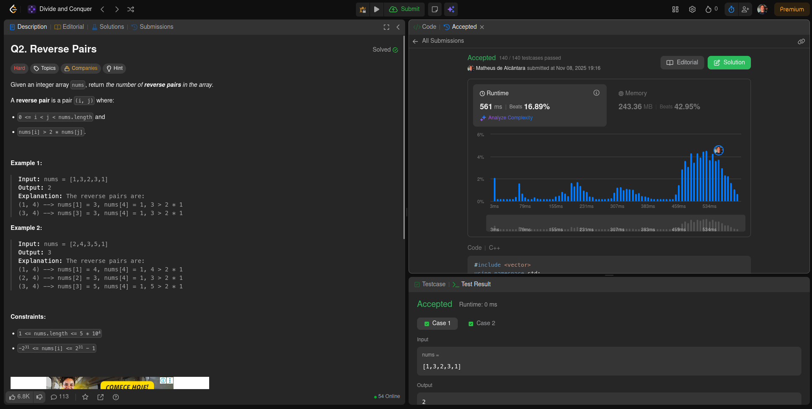
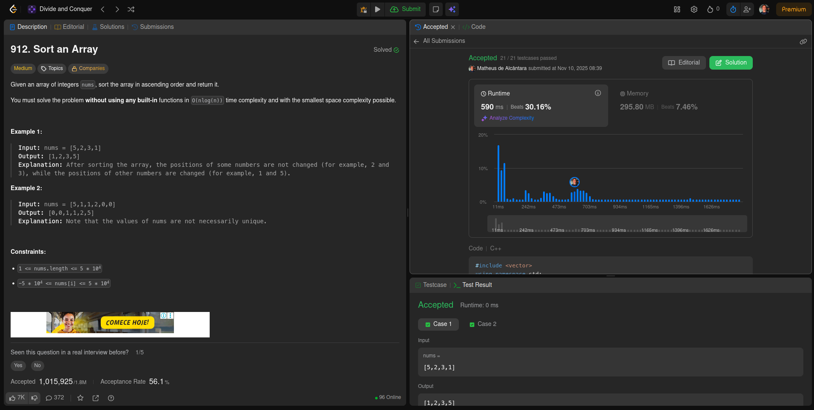
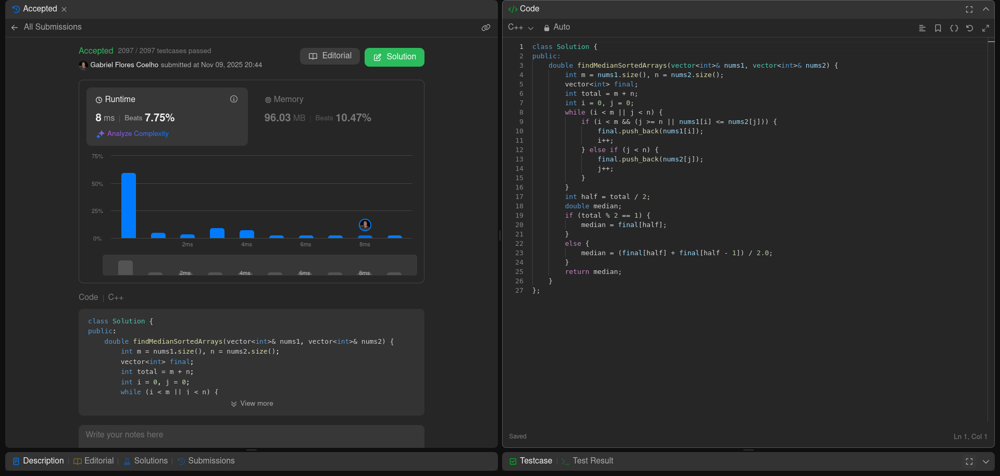
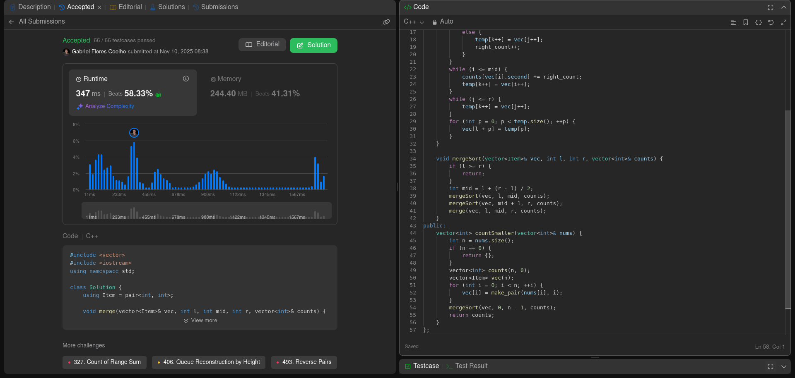

Temas:

- Dividir e Conquistar

# Dividir e Conquistar

**Número da Lista**: 4 
**Conteúdo da Disciplina**: Dividir e Conquistar 

## Alunos

| Matrícula  | Aluno                                |
| ---------- | ------------------------------------ |
| 23/1026509 | Matheus de Alcântara da Silva Campos |
| 23/1026358 | Gabriel Flores Coelho                |

## Sobre

Resolução de exercícios no leetcode

## Screenshots

### [493. Reverse Pairs (Difícil)](https://leetcode.com/problems/reverse-pairs/submissions/1824522902/?envType=problem-list-v2&envId=divide-and-conquer)

### [912. Sort an Array (Médio)](https://leetcode.com/problems/sort-an-array/submissions/1824524863/?envType=problem-list-v2&envId=divide-and-conquer)

### [4.Median_of_Two_Sorted_Srrays (Difícil)](https://leetcode.com/problems/median-of-two-sorted-arrays/description/)

### [315.Count_of_Smaller_Numbers_After_Self (Difícil)](https://leetcode.com/problems/count-of-smaller-numbers-after-self/description/)

## Vídeo Explicativo

[Link_vídeo_explicativo](https://youtu.be/6ZgSK8GLG0s)
[Link_vídeo_explicativo2](https://youtu.be/jZi6T2iYHfk?si=0qdVOCjpWpgkGFJv)

## Instalação

**Linguagem**: C/C++ 
**Compilador**: GCC 

## Uso

É possível executar o programa no site do Leetcode, acessando o link do exercício desejado, clicando em "Code", colando o código na área indicada e depois clicando em "Submit".
